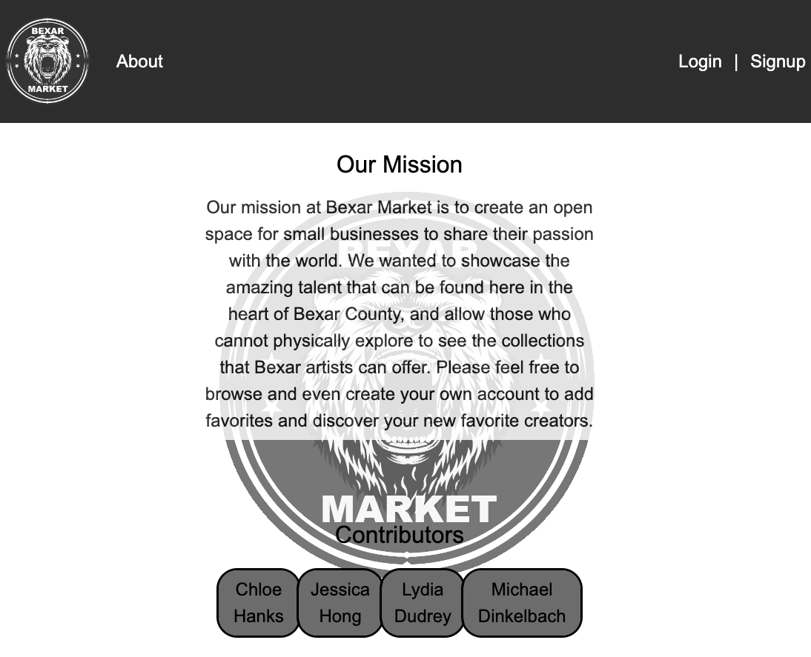

# Bexar Market

# Table of Contents

1. [Description](#description)
2. [Project Requirements](#project-requirements)
3. [Installation](#installation)
4. [Link to App](#usage)
4. [Credits](#credits)

## Description
This project demonstrates to prospective employers collaborative skills and coding abilities, especially in the context of a scalable, user-focused MERN app. In this project, we created a MERN stack single-page application to encourage patronage at local businesses throughout Bexar County, San Antonio, TX. A person will be able to signup either as a viewer or a business. 

> **_NOTE 1:_** A person must be signed in as a user to view products. A person must be signed in as a business to add products.

## Project Requirements

```md
* Use React for the front end.

* Use GraphQL with a Node.js and Express.js server

* Must be able to retrieve, add, update, and delete data

* Use MongoDB and the Mongoose ODM for the database.

* Use queries and mutations for retrieving, adding, updating, and deleting data.

* Be deployed using Heroku (with data).

* Have a polished UI.

* Be responsive.

* Be interactive (i.e., accept and respond to user input).

* Include authentication (JWT).

* Protect sensitive API key information on the server.

* Have a clean repository that meets quality coding standards (file structure, naming conventions, best practices for class and id naming conventions, indentation, high-quality comments, etc.).

* Have a high-quality README (with unique name, description, technologies used, screenshot, and link to deployed application).
```


## Installation

From the root folder:

```md
- npm install

- npm run seed

- npm run start
```

## Usage

1. First, click on the [live URL]([insert Heroku App Here])

2. If you have not signed up, navigate to the signup page. For future development, if a person opts to signup as a user, then the business form will be disabled (and vice versa). If you already have an account, navigate to the login page.


3. Use the links in the navigation to view the About page to see the mission statement, or click the Home page to view the list of participating business.




4. Click on a business to view their available products.


5. Click on Profile to view your personal profile page. You can update your credentials here.


## Credits:
1) [Tailwind Install](https://tailwindcss.com/docs/guides/create-react-app)
2) [Tailwind Tutorial](https://www.youtube.com/watch?v=32StJIZScX4)
3) [React Image Upload Made Easy](https://www.youtube.com/watch?v=XeiOnkEI7XI)
4) [Loop Inside React JSX](https://stackoverflow.com/questions/22876978/loop-inside-react-jsx)
5) [React: Passing props to function components](https://stackoverflow.com/questions/39963565/react-passing-props-to-function-components/59540647#59540647)
6) [Redirect to another page using useNavigate()](https://bobbyhadz.com/blog/react-onclick-redirect)
7) [Logo design by dgim-studio](http://www.freepik.com) 
8) [The create-react-app imports restriction outside of sec directory](https://stackoverflow.com/questions/44114436/the-create-react-app-imports-restriction-outside-of-src-directory)